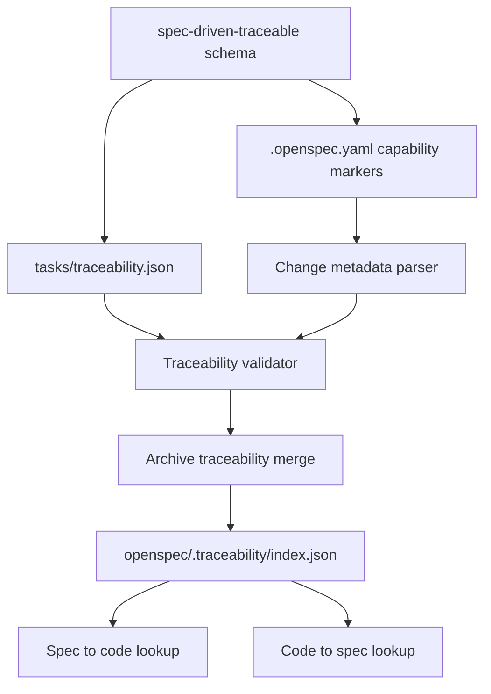

# Capability Markers and Spec-Code Traceability

Feature Name: capability-markers-traceability
Updated: 2026-06-29

## Description

本设计为 OpenSpec 增加 `spec-driven-traceable` schema。该 schema 继承 `spec-driven` 的 proposal、specs、design、tasks 工作流，并在 change metadata 与 tasks 阶段增加 capability markers 和 per-change traceability 产物。

目标能力包括：

- 在 `.openspec.yaml` 中声明 `provides`、`requires`、`touches`、`dependsOn`。
- 在 `openspec/changes/<change>/tasks/traceability.json` 记录 change 产生的 spec-code 映射。
- 在 `openspec/.traceability/index.json` 维护 archive 后的双向累积索引。
- 在 archive 流程中校验并合并 traceability 数据。
- 为后续 CLI 查询能力保留稳定的数据访问接口。

## Architecture



实现按四层拆分：

- Schema 层：新增 `schemas/spec-driven-traceable/schema.yaml` 与 `traceability.md` 模板说明，将 `traceability.json` 作为 tasks 阶段额外产物。
- Metadata 层：扩展 change metadata Zod schema，解析 capability markers，并提供 capability ID 校验。
- Traceability 层：新增独立 core 模块负责读取、校验、合并和写入 traceability 索引。
- Archive 集成层：在现有 archive 成功更新 specs 后、移动 change 到 archive 前合并 traceability 索引。

## Components and Interfaces

### 1. Schema Definition

新增目录：

```text
schemas/spec-driven-traceable/
├── schema.yaml
└── templates/
    ├── proposal.md
    ├── design.md
    ├── tasks.md
    ├── spec.md
    └── traceability.md
```

`schema.yaml` 保持 `spec-driven` 原有 artifact 顺序，并增强 tasks instruction，要求 tasks 完成时产出 `tasks/traceability.json`。

建议 artifact 配置：

```yaml
name: spec-driven-traceable
version: 1
description: Spec-driven workflow with capability markers and spec-code traceability
artifacts:
  - id: proposal
    generates: proposal.md
    template: proposal.md
    requires: []
  - id: specs
    generates: "specs/**/*.md"
    template: spec.md
    requires: [proposal]
  - id: design
    generates: design.md
    template: design.md
    requires: [proposal]
  - id: tasks
    generates: tasks.md
    template: tasks.md
    requires: [specs, design]
  - id: traceability
    generates: tasks/traceability.json
    template: traceability.md
    requires: [tasks]
apply:
  requires: [tasks]
  tracks: tasks.md
```

Artifact graph 已支持任意 artifact ID 与 `generates` 字段，因此新增 schema 主要是配置和模板变更。`apply.requires` 继续指向 tasks，确保现有 apply 行为稳定。

### 2. Change Metadata Schema

扩展 `src/core/change-metadata/schema.ts`：

```ts
const CapabilityIdSchema = z.string().regex(/^[a-z0-9][a-z0-9-]*(\/[a-z0-9][a-z0-9-]*)?$/, {
  message: 'capability id must be lowercase area or area/sub-area',
});

export const ChangeMetadataSchema = z.object({
  schema: z.string().min(1, { message: 'schema is required' }),
  created: z.string().regex(/^\d{4}-\d{2}-\d{2}$/).optional(),
  goal: z.string().min(1).optional(),
  affected_areas: z.array(z.string().min(1)).optional(),
  initiative: InitiativeLinkSchema.optional(),
  provides: z.array(CapabilityIdSchema).optional(),
  requires: z.array(CapabilityIdSchema).optional(),
  touches: z.array(CapabilityIdSchema).optional(),
  dependsOn: z.array(KebabIdentifierSchema('Change id')).optional(),
}).strict();
```

校验职责：

- `provides`、`requires`、`touches` 使用统一 capability ID 语法。
- `dependsOn` 使用现有 kebab-case change ID 规则。
- 空数组允许解析，写入时建议省略空字段。
- schema 名称依旧由现有 schema 解析路径验证。

### 3. Traceability Core Module

新增模块：`src/core/traceability/`。

```text
src/core/traceability/
├── schema.ts
├── paths.ts
├── validation.ts
├── index.ts
└── merge.ts
```

公开接口：

```ts
export interface TraceabilityMergeOptions {
  changeName: string;
  changeDir: string;
  openspecRoot: string;
  metadata: ChangeMetadata;
  now?: Date;
}

export interface TraceabilityMergeResult {
  merged: boolean;
  mappingCount: number;
  indexPath: string;
}

export async function mergeTraceabilityForArchive(
  options: TraceabilityMergeOptions
): Promise<TraceabilityMergeResult>;
```

模块职责：

- `schema.ts` 定义 Zod schema 与 TypeScript 类型。
- `paths.ts` 统一解析 `tasks/traceability.json` 与 `.traceability/index.json` 路径。
- `validation.ts` 校验 per-change 文件与 metadata 的一致性。
- `merge.ts` 执行 forward 和 reverse 索引合并。
- `index.ts` 对 archive 和未来 CLI 查询暴露稳定 API。

### 4. Archive Integration

集成点位于 `src/core/archive.ts`：

```text
validate change and specs
read task progress
apply spec updates
merge traceability index
move change directory into archive
return archive result
```

合并放在移动 change 目录前执行，原因是 per-change traceability 位于 active change 路径内。索引写入失败时，archive 流程整体失败，change 保持 active 状态，用户修复 traceability 后可重新执行 archive。

ArchiveResult 建议扩展：

```ts
interface ArchiveResult {
  change: string;
  archivedAs: string;
  path: string;
  specsUpdated: boolean;
  totals?: { added: number; modified: number; removed: number; renamed: number };
  traceability?: {
    merged: boolean;
    mappingCount: number;
    indexPath: string;
  };
}
```

行为规则：

- 当 metadata schema 为 `spec-driven-traceable` 时，archive 要求存在 `tasks/traceability.json`。
- 当 metadata schema 为其他 schema 时，archive 跳过 traceability 合并。
- 当用户传入 `--skip-specs` 时，traceability 合并仍执行，因为 traceability 维护的是代码映射索引。
- 当用户传入 `--no-validate` 时，traceability JSON 结构校验仍执行，因为索引写入需要结构安全。

## Data Models

### Capability Markers

```ts
export type CapabilityId = string;

export interface TraceableChangeMetadata extends ChangeMetadata {
  provides?: CapabilityId[];
  requires?: CapabilityId[];
  touches?: CapabilityId[];
  dependsOn?: string[];
}
```

Capability ID 语法：

```text
area
area/sub-area
```

约束：

- `area` 与 `sub-area` 使用小写字母、数字和单个连字符片段。
- 最多两级路径。
- `area` 对应 `openspec/specs/<area>/`。

### Per-change Traceability

```ts
export const CodeLocationSchema = z.object({
  file: z.string().min(1),
  symbol: z.string().min(1),
  span: z.tuple([z.number().int().positive(), z.number().int().positive()]).optional(),
  line: z.number().int().positive().optional(),
}).strict();

export const TraceabilityMappingSchema = z.object({
  capability: CapabilityIdSchema,
  requirement: z.string().min(1),
  type: z.enum(['provides', 'touch']).default('provides'),
  codeLocations: z.array(CodeLocationSchema).min(1),
}).strict();

export const ChangeTraceabilitySchema = z.object({
  formatVersion: z.literal('1'),
  change: z.string().min(1),
  createdAt: z.string().regex(/^\d{4}-\d{2}-\d{2}$/),
  mappings: z.array(TraceabilityMappingSchema),
}).strict();
```

校验规则：

- `change` 必须等于当前 archive 的 change 名称。
- `type: "provides"` 的 capability 必须出现在 metadata `provides` 中。
- `type: "touch"` 的 capability 必须出现在 metadata `touches` 中。
- 单个文件内重复 `(capability, requirement, type)` 组合时报错。
- `span[0] <= span[1]`。
- `file` 使用相对路径，路径不能上跳到项目根之外。

### Cumulative Index

```ts
export const TraceabilityIndexSchema = z.object({
  formatVersion: z.literal('1'),
  lastUpdated: z.string().regex(/^\d{4}-\d{2}-\d{2}$/),
  forward: z.record(
    CapabilityIdSchema,
    z.record(
      z.string().min(1),
      z.object({ current: z.array(CodeLocationSchema) }).strict()
    )
  ),
  reverse: z.record(
    z.string().min(1),
    z.record(
      z.string().min(1),
      z.object({ implements: z.array(z.string().min(1)) }).strict()
    )
  ),
}).strict();
```

索引引用格式：

```text
<capability>/<requirement>
```

`requirement` 可包含用户可读文本，解析时按 capability 的已知路径前缀定位，查询接口应优先读取 forward 结构，展示层再拼接引用字符串。

## Merge Algorithm

合并输入包括当前 index、change traceability、change metadata 和当前日期。

```ts
function mergeMapping(index: TraceabilityIndex, mapping: TraceabilityMapping): void {
  const ref = `${mapping.capability}/${mapping.requirement}`;

  if (mapping.type === 'touch') {
    for (const location of mapping.codeLocations) {
      addReverseReference(index, location, ref);
    }
    return;
  }

  const oldCurrent = index.forward[mapping.capability]?.[mapping.requirement]?.current ?? [];

  index.forward[mapping.capability] ??= {};
  index.forward[mapping.capability][mapping.requirement] = {
    current: dedupeLocations(mapping.codeLocations),
  };

  for (const location of oldCurrent) {
    removeReverseReference(index, location, ref);
  }

  for (const location of mapping.codeLocations) {
    addReverseReference(index, location, ref);
  }
}
```

辅助函数约束：

- `dedupeLocations` 使用 `file + symbol + line` 作为去重键，`span` 只保留首个出现值。
- `addReverseReference` 对 `implements` 去重并按字符串排序，保证输出稳定。
- `removeReverseReference` 清空空数组后移除对应 symbol，symbol map 为空后移除对应 file。
- 写入索引前按 capability、requirement、file、symbol 排序，减少 git diff 噪声。

## Correctness Properties

必须保持以下不变量：

- 对每个 `forward[capability][requirement].current` location，`reverse[file][symbol].implements` 包含对应 `<capability>/<requirement>` 引用。
- `type: "provides"` mapping 覆盖同一 `(capability, requirement)` 的 forward current。
- `type: "touch"` mapping 只追加 reverse 引用。
- archive 写入索引和移动 change 目录按顺序执行，索引合并失败时 active change 仍保留。
- `traceability.json` 作为 per-change 审计文件保存在 archive 后的 change 目录中。
- `formatVersion` 控制读写兼容性，版本不匹配时报错并提示升级路径。

## Error Handling

### Validation Errors

traceability 校验错误使用专门错误类型：

```ts
export class TraceabilityValidationError extends Error {
  readonly code: string;
  readonly fix?: string;
}
```

建议错误码：

- `traceability_missing`: `spec-driven-traceable` change 缺少 `tasks/traceability.json`。
- `traceability_invalid_json`: JSON 解析失败。
- `traceability_schema_invalid`: Zod schema 校验失败。
- `traceability_change_mismatch`: `change` 字段与当前 change 名称不一致。
- `traceability_duplicate_mapping`: 出现重复 mapping key。
- `traceability_marker_mismatch`: mapping type 与 `.openspec.yaml` markers 不一致。
- `traceability_index_invalid`: 现有累积索引结构异常。

### Archive JSON Mode

`archive --json` 应输出机器可读失败信息：

```json
{
  "archive": null,
  "status": [
    {
      "severity": "error",
      "code": "traceability_missing",
      "message": "Traceability file is required for schema 'spec-driven-traceable'.",
      "fix": "Create tasks/traceability.json or use a non-traceable schema."
    }
  ]
}
```

### Index Write Safety

索引写入流程：

1. 读取现有 index，缺失时创建空 index。
2. 校验现有 index 结构。
3. 在内存中合并 mapping。
4. 校验合并后的 index 结构与不变量。
5. 写入 `index.json.tmp`。
6. 使用 `fs.rename` 替换 `index.json`。

## Test Strategy

### Unit Tests

新增测试目录：`test/core/traceability/`。

覆盖点：

- capability ID 接受 `auth`、`auth/session`，拒绝多级路径、大写和空片段。
- `ChangeTraceabilitySchema` 正确填充默认 `type: "provides"`。
- 重复 `(capability, requirement, type)` mapping 报错。
- `provides` mapping 覆盖 forward current 并重建 reverse。
- `touch` mapping 追加 reverse 并保持 forward 原值。
- 同一 symbol 多个 requirement 引用时，移除一个 ref 后保留其他 ref。
- index 排序输出稳定。

### Integration Tests

新增 archive 集成测试 fixture：

```text
test/fixtures/traceability/
└── openspec/
    ├── changes/
    │   └── add-password-timeout/
    │       ├── .openspec.yaml
    │       ├── proposal.md
    │       ├── specs/auth-session/spec.md
    │       ├── tasks.md
    │       └── tasks/traceability.json
    └── specs/
```

覆盖流程：

- archive `spec-driven-traceable` change 后创建 `.traceability/index.json`。
- 第二个 change 覆盖同一 requirement 后，forward current 使用第二个 change 的完整快照。
- touch mapping 只增加 reverse 引用。
- `--json` 模式下 traceability 错误进入 `status` 数组。

### Validation Commands

建议后续实现 `openspec validate <change>` 时复用 traceability validator，在 archive 前提前发现错误。首期实现可以只在 archive 中强制校验，降低改动面。

## Migration Plan

实施步骤：

1. 新增 `spec-driven-traceable` schema 与模板。
2. 扩展 `ChangeMetadataSchema` 支持 capability markers。
3. 新增 `src/core/traceability` Zod schema、读取、校验与合并模块。
4. 在 archive 流程中集成 `mergeTraceabilityForArchive`。
5. 增加 unit tests 和 archive integration tests。
6. 更新用户文档，说明 schema 选择、metadata 字段和 traceability 文件格式。

回滚策略：

- 移除 `spec-driven-traceable` schema 后，新 change 无法选择该 workflow。
- 已生成的 `.traceability/index.json` 是派生索引，可由 archived changes 中的 `tasks/traceability.json` 重建。
- 现有 `spec-driven` change 行为保持稳定。

## Open Questions

- 是否在首期提供 `openspec traceability query` CLI，或先只完成 archive 索引维护。
- `dependsOn` 是否需要在 archive 前校验目标 change 已 archive，或只作为排序提示展示。
- capability ID 的 `area` 是否严格要求对应 `openspec/specs/<area>/`，或允许在 change archive 后再出现。
- `touch` reverse 引用是否需要在后续 provides 覆盖同一 requirement 时自动清理。

## References

- `当前工作区/docs/capability-markers-and-traceability.md`
- `当前工作区/src/core/archive.ts`
- `当前工作区/src/core/change-metadata/schema.ts`
- `当前工作区/src/core/artifact-graph/types.ts`
- `当前工作区/schemas/spec-driven/schema.yaml`
